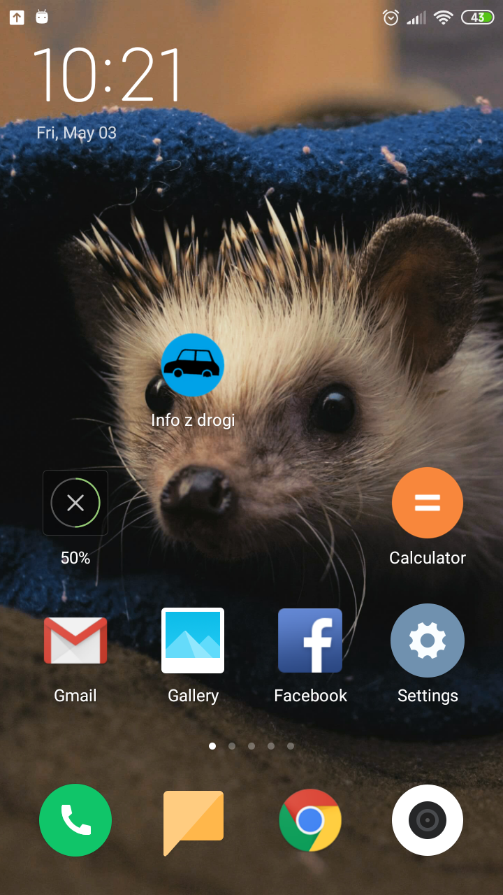
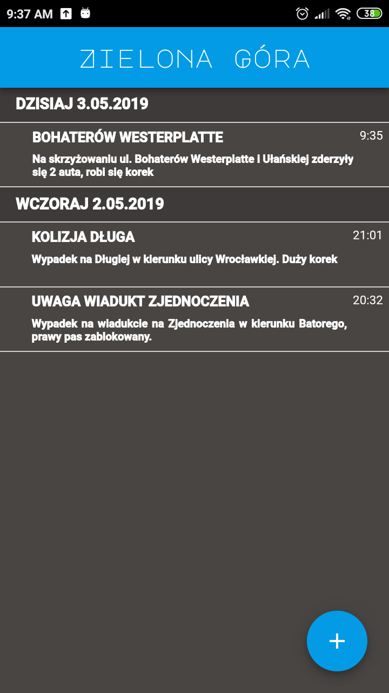
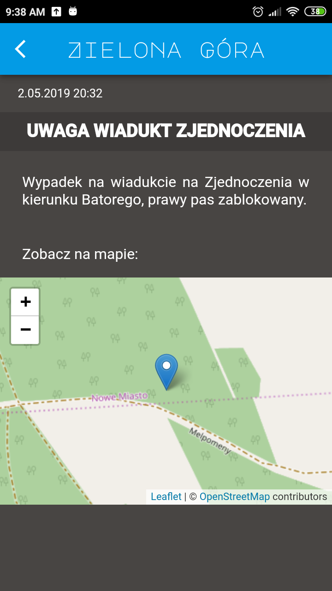
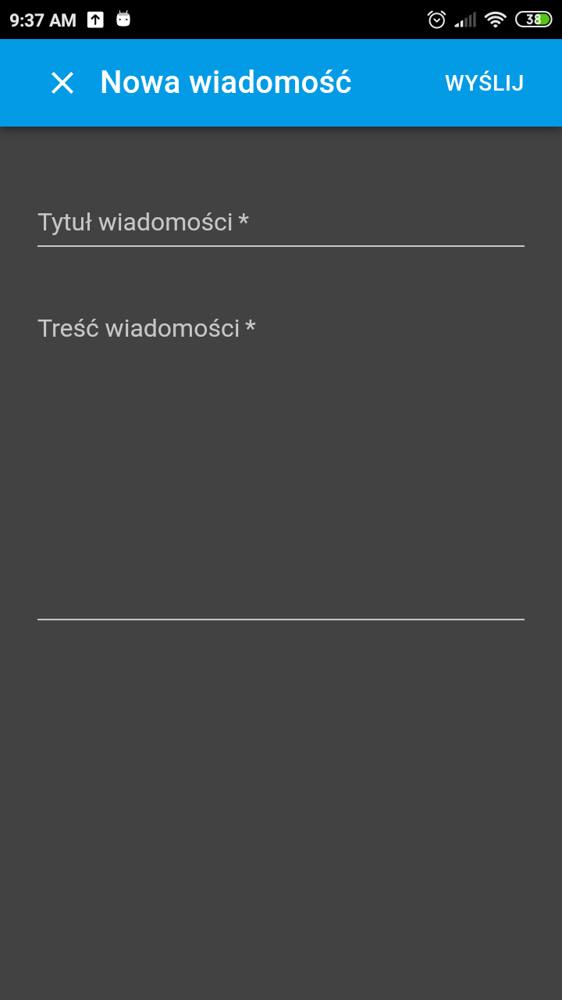
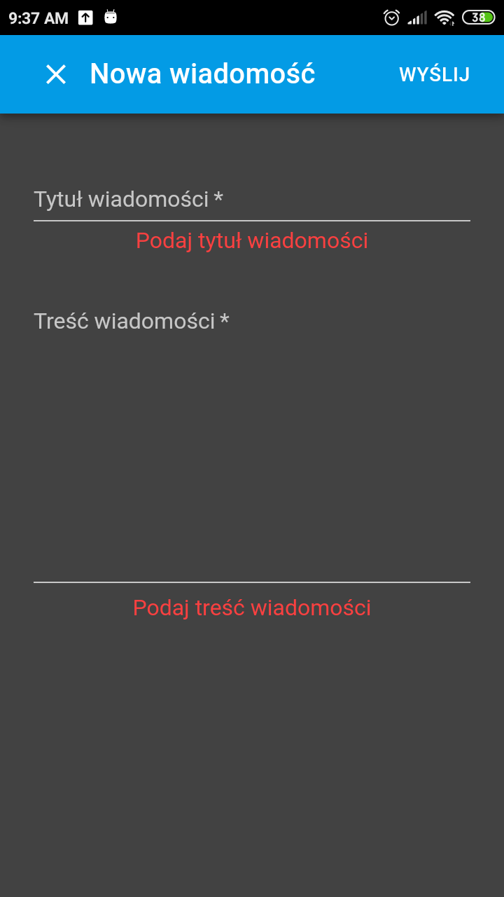

**About application:**

A web application that informs users of accidents on roads in their cities. It uses MQTT to subscribe nearest city and publish news messages to it. User while publishing message, is also sending his location, which will be displayed on a map while reading them by receivers.


**Technologies used in the project:**
- JavaScript
  -	React
  -	Node.js
  -	Leaflet – library for mobile-friendly interactive maps
  - Mongoose
- MongoDB
-	MQTT broker Mosca
-	Material UI


**Requirements:**
- Node.js v. 8.11.3 or above
- NPM v. 5.6.0 or above
- MongoDB v. 3.2.3 or above

**Install**

Install MongoDB server according to [offical documentation.](https://docs.mongodb.com/manual/tutorial/install-mongodb-on-windows/)

Download or clone the repo via git. And then install the dependencies with npm in frontend and backend folders
```
npm install
```
 

**How to run application:**

In frontend folder run:

```
npm run start
```
 
In backend folder run:

```
node server.js
node broker.js
node db.js
```

**Task list:** https://trello.com/b/BM4951xu/call-of-code

**Screenshots:**

<div align="center">





 </div>
